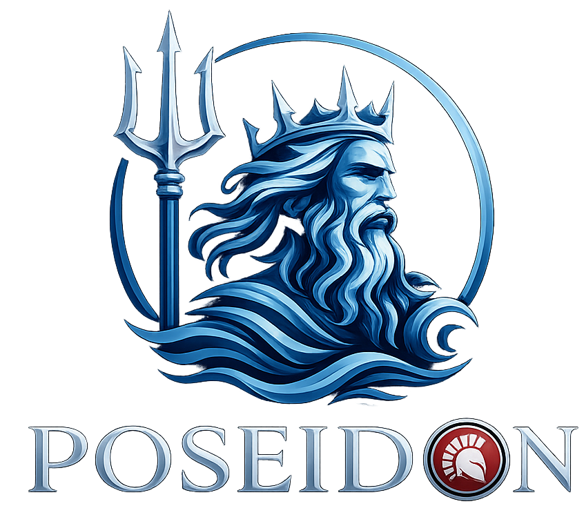

# Poseidon

> *Deus dos mares - poder bruto, velocidade incomparavel.*

<p align="center">
  
</p>

<p align="center">
  Framework HTTP assincrono nativo, zero dependencias, para Delphi e Free Pascal.<br/>
  IOCP/RIO no Windows, io_uring/epoll no Linux - HTTP/1.1, HTTP/2, WebSocket e 20 middlewares integrados de fabrica.<br/>
  <strong>128k RPS, zero erros com 500 conexoes simultaneas.</strong>
</p>

---

## Inicio Rapido

```pascal
program MyServer;
{$APPTYPE CONSOLE}
uses
  System.SysUtils,
  Poseidon.Native.Types,
  Poseidon.Native.Server;

var
  App: TPoseidonServer;
begin
  App := TPoseidonServer.Create;
  try
    App.Get('/ping',
      procedure(var Ctx: TNativeRequestContext)
      begin
        Ctx.Status := 200;
        Ctx.ContentType := 'application/json';
        Ctx.Body := TEncoding.UTF8.GetBytes('{"message":"pong"}');
      end);

    App.Get('/hello/:name',
      procedure(var Ctx: TNativeRequestContext)
      begin
        Ctx.Status := 200;
        Ctx.ContentType := 'application/json';
        Ctx.Body := TEncoding.UTF8.GetBytes('{"hello":"' + Ctx.Param('name') + '"}');
      end);

    App.Listen(9000, '0.0.0.0',
      procedure
      begin
        Writeln('Servidor pronto em http://localhost:9000');
        Readln;
        App.Stop;
      end);
  finally
    App.Free;
  end;
end.
```

## Por que Poseidon

| | Poseidon v2 | Horse Epoll 4.0 |
|---|---|---|
| **Throughput** (500 conn, 16 cores) | **127.532 RPS** | 3.780 RPS (61% erros) |
| **Latencia p50** | **1,92ms** | 103ms |
| **Latencia p99** | **5,51ms** | 287ms |
| **Erros** | **0** | 35K+ Non-2xx |
| **Arquitetura** | Shared-nothing per-core | Single epoll |
| **HTTP/2** | Integrado | Nao |
| **WebSocket** | Integrado | Nao |
| **SSL/TLS** | OpenSSL nativo (SNI, mTLS, ALPN) | Via Indy |
| **Middlewares** | 20 integrados | Comunidade |
| **API Nativa** | Zero-copy, baseada em instancia | N/A |

## Arquitetura: Shared-Nothing Per-Core

<p align="center">
  
</p>

Cada core faz tudo: accept, recv, parse, executa handler, envia resposta. Sem filas, sem locks, sem contencao. Escalamento linear com o numero de cores.

O backend de I/O e selecionado **uma unica vez** na inicializacao, com fallback automatico: **IOCP** (padrao no Windows) ou **RIO** (opt-in, polling sem syscall via `FORCE_RIO`); **io_uring** >= 5.1 (padrao no Linux) ou **epoll** (fallback / opt-in via `FORCE_EPOLL`).

---

## Performance vs. o Mercado

Treze servidores HTTP, um de cada vez, na mesma máquina e na mesma janela - sete frameworks
já conhecidos deste comparativo mais seis representantes clássicos de outros ecossistemas
(Node.js, Python, Ruby, PHP, Java), pra responder de forma direta: um framework HTTP em Object
Pascal compete de igual pra igual com os nomes mais conhecidos do mercado?

**Cenário.** Carga mista: 40% `/plaintext` (13 B), 30% `/json` (27 B), 30% `/json-large` (63 KB),
gerada por `wrk -t4 -c200` durante 300 s por framework, após 20 s de aquecimento descartado. Cada
servidor rodou em Docker com `--cpuset-cpus` fixando **2 núcleos físicos dedicados** (`--cpus=2.0`,
limite de **1 GB** de memória); o gerador de carga ficou isolado em outros 2 núcleos físicos
dedicados, numa rede bridge dedicada (não `--network host`, pra funcionar em Windows+Docker Desktop
também - ver métodologia completa e as trocas envolvidas em
[`benchmark/README.md`](benchmark/README.md)). Os treze serviram payloads byte a byte idênticos e
o mix medido saiu 40,0/30,0/30,0 em todos. Host: debian-bench (4 núcleos físicos totais). Reproduza
você mesmo com `benchmark/scripts/run-all.sh` (ou `.ps1` no Windows) - constrói e mede todos os
treze a partir do código-fonte real de cada framework, sem nada vendorizado.

uWebSockets (uws) não entra nesta tabela. Não é um framework HTTP de propósito geral: é uma
biblioteca de sockets/event-loop sem backpressure, sem timeout de conexão, sem headers de
segurança e sem upgrade de protocolo embutidos - nenhuma das features que todo outro concorrente
aqui (Poseidon incluso) paga no caminho quente. Medir throughput contra ela responde "quão rápido
é um event loop nu", não "quão rápido é este framework", que é a pergunta que esta tabela quer
responder.

| Posição | Framework | Tecnologia | Req/s | p50 | p99 | Máx | Erros |
|---:|---|---|---:|---:|---:|---:|---:|
| 1 | Actix | Rust | 27.249 | 4,88 ms | 17,58 ms | 71 ms | 0 |
| **2** | **Poseidon v2** | **Object Pascal** | **25.289** | **5,39 ms** | **23,37 ms** | **95 ms** | **0** |
| 3 | Go Fiber | Go | 23.792 | 7,52 ms | 28,17 ms | 106 ms | 0 |
| 4 | mORMot2 | Object Pascal | 22.634 | 5,67 ms | 30,67 ms | 405 ms | 0 |
| 5 | nginx | C | 18.241 | 9,63 ms | 29,98 ms | 199 ms | 0 |
| 6 | Kestrel | C#/.NET | 10.776 | 15,83 ms | 95,92 ms | 1.539 ms | 200 |
| 7 | Spring Boot | Java | 7.451 | 20,40 ms | 746,93 ms | 1.997 ms | 18 |
| 8 | Horse (Epoll) | Object Pascal | 4.923 | 35,96 ms | 110,29 ms | 211 ms | 0 |
| 9 | Express | Node.js | 2.594 | 74,78 ms | 110,25 ms | 1.981 ms | 56 |
| 10 | FastAPI | Python | 1.501 | 127,39 ms | 188,90 ms | 794 ms | 0 |
| 11 | Django | Python | 643 | 224,35 ms | 493,30 ms | 965 ms | 0 |
| 12 | Rails (Puma) | Ruby | 595 | 324,11 ms | 454,24 ms | 563 ms | 0 |
| 13 | Laravel | PHP | 160 | 1.142,97 ms | 1.787,06 ms | 1.999 ms | 1.414 |

### O que os números dizem

Segundo de treze, a 7,2% do primeiro - um servidor Rust escrito à mão continua na frente, mas por
uma margem pequena. O que essa tabela realmente mostra é a distância pros nomes que a maioria
associa a "framework web de produção":

- **2,3x o Kestrel** (C#/.NET), **3,4x o Spring Boot** (Java, o framework enterprise mais usado do
  mundo Java) e **5,1x o Horse** (o outro framework Object Pascal da lista).
- **9,8x o Express** (o framework Node.js mais usado que existe), **16,8x o FastAPI** (Python),
  **39x o Django** (Python) e **42x o Rails com Puma** (Ruby, o app server padrão do Rails desde a
  v5).
- **158x o Laravel** (PHP) - mas isso reflete o PHP-FPM padrão saturando sob carga sustentada
  (1.414 erros no meio de 300 s), não uma comparação particularmente informativa por si só.
- Ainda na frente do Go Fiber, mORMot2 e nginx - os três mais próximos depois do Actix.

Rails e Django rodam sem banco de dados (nenhum dos três endpoints precisa de persistência) e
Express/FastAPI/Spring Boot/Kestrel usam o próprio servidor padrão de cada framework, sem tuning
de produção além do default - ver as trocas completas e o motivo de cada uma em
[`benchmark/README.md`](benchmark/README.md#methodology-notes--honest-caveats) (em inglês).

Duas correções entraram no Poseidon durante uma medição anterior neste mesmo comparativo (num host
diferente, 16 núcleos): um relógio do idle sweep que estourava em `UInt64` e fechava justamente as
conexões **mais movimentadas** (6.405 erros de socket espúrios, agora zero, e +12% de throughput de
brinde), e o dimensionamento de IO workers que ignorava o orçamento de CPU do contêiner (p99 31%
menor em A/B pareado, 67% com 4 CPUs). Detalhes adicionais de metodologia em
[`docs/playbook_pt-br/07-benchmarking`](docs/playbook_pt-br/07-benchmarking); um harness de
benchmark em Delphi standalone (sem Docker) está em
[`samples/08-benchmark/`](samples/08-benchmark/) - os números desta tabela vêm do harness Docker
reproduzível em [`benchmark/`](benchmark/).

<p align="center">
  
</p>

Toda mudanca no caminho quente e validada com uma comparacao controlada antes/depois antes de ser mergeada - mesmo binario, uma mudanca por vez. A rodada de parser/dispatcher de 2026-08-07 (removeu uma alocacao redundante no header `Connection`, pulou a varredura de deteccao de upgrade em GETs sem upgrade) mediu **+1,7% de throughput**, com toda repeticao do lado "depois" superando toda repeticao do lado "antes".

---

## Funcionalidades

**Engine** - HTTP/1.1 keep-alive · HTTP/2 (ALPN h2, h2c, server push, flow control) · WebSocket (RFC 6455, permessage-deflate) · HTTPS com OpenSSL nativo (SNI, mTLS) · Compressao gzip + Brotli · Proxy Protocol v1/v2 · Graceful reload (PID file, SIGTERM, zero-downtime) · Windows 64-bit (IOCP/RIO) + Linux 64-bit (io_uring/epoll) · Delphi 11+ e Free Pascal 3.3.1

**Framework** - Router hash-map, lookup O(1), suporte a `:param` · Registro fluente de rotas (Get/Post/Put/Delete/Patch/Head/All) · Contexto de requisicao zero-copy, stack-allocated · Binding de DTO com atributos de validacao · OpenAPI 3.x + Swagger UI · RFC 7807 Problem Details · Cookies assinados (HMAC-SHA256)

**Engenharia de performance** - Contadores atomicos com padding de cache-line · I/O vetorizado (writev/WSASend) · Arquivos registrados no io_uring + multishot accept · Reciclagem de sockets via DisconnectEx (Windows) · Arena de headers thread-local · Buffer pool de 8 KB (Acquire/Release)

**20 middlewares integrados** - CORS, JWT, Logger, RateLimit, Compression, Timeout, BodyLimit, RequestID, CircuitBreaker, Metrics, Static, HealthCheck, Security, Proxy, Digest, Guard, Validation, ProblemDetails, OpenAPI, Cache

---

## Requisitos

- **Delphi 11 Alexandria ou superior**, ou **Free Pascal 3.3.1** (trunk)
- Windows 64-bit ou Linux 64-bit
- OpenSSL no PATH (apenas para HTTPS/HTTP2)

## Instalacao

Adicione `src/`, `src/compat/` e `middlewares/` ao search path do projeto:

```
<poseidon>\src
<poseidon>\src\compat
<poseidon>\middlewares
```

### Free Pascal / Lazarus

O Poseidon compila e serve sob FPC 3.3.1 no Win64 (IOCP) e Linux (io_uring/epoll)
alem do Delphi. Notas:

- Requer **FPC 3.3.1** (trunk) - `reference to` / metodos anonimos e RTTI de
  atributos nao existem no release 3.2.2. Compile com
  `-MDELPHIUNICODE -Mfunctionreferences -Manonymousfunctions -Mprefixedattributes`.
- No Linux, `cthreads` deve ser a **primeira** unit do programa (`{$IFDEF UNIX}`)
  para ativar o RTL com threads.
- Sob FPC o servidor usa **SyncDispatch** por padrao (dispatch inline); o modo
  async (worker pool) e best-effort no trunk atual do FPC.
- Gates de referencia: `tests/fpc/build-server-fpc.ps1` (Windows),
  `tests/fpc/build-linux-fpc.sh` (Linux).

## Exemplos de Uso

### Middleware

```pascal
uses
  Poseidon.Native.Types,
  Poseidon.Native.Server,
  Poseidon.Middleware.CORS,
  Poseidon.Middleware.JWT,
  Poseidon.Middleware.Logger;

var
  App: TPoseidonServer;
begin
  App := TPoseidonServer.Create;

  App.Use(CORSMiddleware);
  App.Use(LoggerMiddleware);
  App.Use(JWTMiddleware('meu-segredo'));

  App.Get('/api/dados',
    procedure(var Ctx: TNativeRequestContext)
    begin
      Ctx.Status := 200;
      Ctx.ContentType := 'application/json';
      Ctx.Body := TEncoding.UTF8.GetBytes('{"dados":"protegidos"}');
    end);

  App.Listen(9000);
end.
```

### WebSocket

```pascal
App.WebSocket('/ws',
  procedure(Conn: IPoseidonWSConn; MsgType: Byte; Data: TBytes)
  begin
    Conn.Send(Data);  // echo
  end);
```

### SSL/TLS

```pascal
App.ConfigureSSL('cert.pem', 'key.pem');
App.AddSSLCert('api.exemplo.com', 'api-cert.pem', 'api-key.pem');  // SNI
App.EnableHTTP2;
App.Listen(443);
```

Mais receitas (grupos de rotas, graceful reload, hardening de seguranca, metricas) vivem no [playbook](docs/playbook_pt-br/README.md).

---

## Documentacao

- [Referência de API](docs/API-REFERENCE_pt-br.md) · [API Reference (EN)](docs/API-REFERENCE.md)
- [Playbook (English)](docs/playbook/README.md)
- [Playbook (Portugues)](docs/playbook_pt-br/README.md)
- [FuzzRunner - fuzzing contínuo dos parsers](tests/FUZZING.md)
- [Contributing](docs/CONTRIBUTING.md)
- [Como contribuir (pt-BR)](docs/CONTRIBUTING_pt-br.md)

## A Familia Olimpica

> *Poseidon comanda os mares - poder bruto, a engine assíncrona sob as ondas.*
> *Triton, seu filho, guarda as profundezas - retém as conexões que não podem se perder.*
> *Hermes percorre todos os reinos - carrega mensagens, mais rápido que qualquer onda.*
> *Hefesto forja nas profundezas - invisível, incansável, transformando matéria bruta em obra acabada.*
> *Apollo é o deus da luz e da verdade - traz tudo à luz.*

| Projeto | Mito | Papel |
|---------|------|-------|
| **Poseidon** (este) | Deus dos mares | Framework HTTP assíncrono nativo + engine de I/O - IOCP/RIO, io_uring/epoll |
| [**Triton**](https://github.com/herlondf/triton) | Filho de Poseidon, guardião das profundezas | Pool de recursos genérico - conexões, clientes, SMTP |
| [**Hermes**](https://github.com/herlondf/hermes) | Mensageiro dos deuses, guia entre os reinos | Cliente Redis - chave-valor, pub/sub, mensageria |
| [**Hefesto**](https://github.com/herlondf/hefesto) | Forjador dos deuses, trabalha nas sombras | Jobs em background - filas, workers, retry, agendamento |
| [**Apollo**](https://github.com/herlondf/apollo) | Deus da luz e da verdade, traz as coisas à luz | Logging estruturado - sinks assíncronos, OTLP, Seq, Loki, Datadog |

---

## Licenca

MIT

---

> 🇺🇸 Read this document in English: [README_en.md](./README_en.md)
